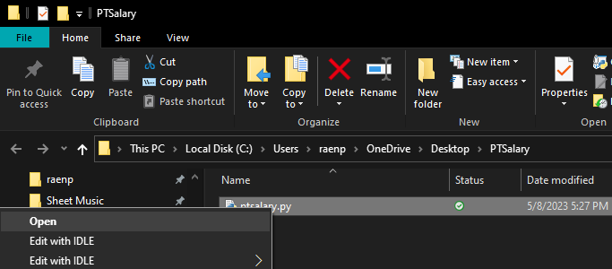

# Part Time Salary Calculator: User Guide

#### This user guide will walk you through installing Python and using the ptsalary app.

If you're looking at this and you're in HR but don't have any experience with Python you're probably thinking, how do I run this weird ptsalary.py file? This document will help you get up and running in no time. 

#### Housekeeping
Before you can run ptsalary.py you'll need to do some housekeeping. 

First, you'll notice that the file ends in .py. That indicates it's a python file. Python is a versatile scripting language and you'll need to make sure your computer can understand it. The process is a little different depending on whether you're using OSX or Windows, and steps for each operating system are detailed below. 

#### TL;DR
For both OSX and Windows you'll need to:

1. Download the ptsalary.py file, or the compiled version of you're on OSX
2. Check your version of Python
3. Install Python if you don't already have it or if it's below 3.x
4. Run the script via a Terminal window on OSX or a Command Prompt on Windows. If you're on OSX you also have the option of running a packaged form of the script letting you simply double click an icon.

#### Okay, but how do I use the script?
You can jump to the end of this file if you just want instructions for using the script. 

# Requirements

 - Python 3.x.x
 - Windows, MacOS, Linux

# Updates

### Nov 2020
Added a compiled version of Part Time Salary Calculator. Mac OS X compatible. 

Find it in: PTSalary Standalone - Mac OS X compatible. 

No need to install Python. Once downloaded, unzip the file and double click ptsalary. View the associated README for more info. However, if you'd like to learn more about Python, how to get it up and running and how to use Terminal, follow along below.

# Install Python

To run this ptsalary.py you'll need to ensure your computer has Python installed and that you have version 3.x or higher. Versions of Python prior to 3.x will not be able to run the script.

## Install Python on Mac OSX
 
If you have a Mac you likely already have an older version of Python installed. However, you'll need to have at least version 3.0 to use Part Time Salary Calculator. 

### Open Terminal
To check your current version of Python you'll need to open up an application called Terminal. You can do this one of two ways:
1. Click the Spotlight icon in the top right corner of the menu bar. In the search box that opens type Terminal and click Terminal in the results 
2. In Finder, open the Applications/Utilities folder, then double-click Terminal

### Check Which Version of Python is Installed 

*If you don't have 3.x or higher Part Time Salary Calculator will not run so be sure to update to the latest version.*

To check your current, default, version of Python type the following into Terminal:
 
`user$ python --version`

To check which version of Python3 is installed type: 

`user$ python3 --version`

As of this writing the current version of Python is 3.11.0. 

### Installation
You can install Python from Terminal however you can also go to [python.org](https://www.python.org/downloads/) and download the latest version. When the pkg is done downloading run it and follow the on screen prompts.

## Install Python on Windows

Windows does not come with Python already installed so you'll likely need to install Python first. However, if you'd like to make sure it's not already installed you can do so from the command prompt. To open the command prompt do the following:

### Open A Command Prompt

1. Press the Windows Key ⊞ 
2. Type 'command' into the search box.
3. Next to the C:\ prompt type:

``C:\Users\yourName> python --version``

### Installation
If Python isn't installed or you only have a version prior to 3.x you'll need to  [download a copy of python for windows here: ](https://www.python.org/downloads/windows/)https://www.python.org/downloads/windows/

*Note that version 3.9.x is not compatible with Windows 7 and earlier versions.*

Select the latest version compatible with your version of Windows. Once the installer has finished downloading run it and follow the on screen prompts.

# Running the Script on OSX

If you're using OSX you have several options for running PTSalary. You can use the PTSalary app, you can run the .py file using the Python Launcher via the right-click context menu.

### Using the PTSalary App *(Mac Only)*

1. After you've installed the latest version of Python, download the .zip file part-time-salaries/ PTSalary Standalone - Mac OSX compatible 
2. Unzip the file 
3. Open the unzipped file and find the ptsalary icon, double-click it.

### Using the Context Menu
1. Download the ptsalary.py file
2. In OSX, navigate to where you saved the ptsalary.py file and right-click it
4. In the context menu, go to Open With > Python Launcher (3.x.x)

 
 
*If OS X asks for permissions click yes.*

# Running the Script on Windows

Now that you've installed Python it's time to run the script. To do so, do the following:

1. Navigate to where you saved the ptsalary.py file and right-click it
2. Click on *Open*
3. Follow the on-screen instructions or see below for further details

# Using The PTSalary.py App

After you've opened the script a window will open. Part Time Salary Calculator will display at the top of the screen. To calculate your new salary based on fewer than 40 hours of work per week do the following:
1. Type the full time salary, annually, **omitting any commas**. For example, **if the employee's salary is $68,000.33 per year, enter 68000.33**.
2. Press Enter
3. Enter the new number of hours the employee will be working. For example, 34.
4. Press Enter
5. The window will display the new annual salary.
6. To close the window, type Exit

