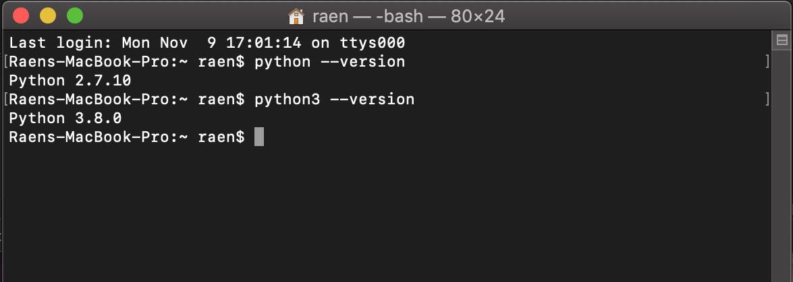
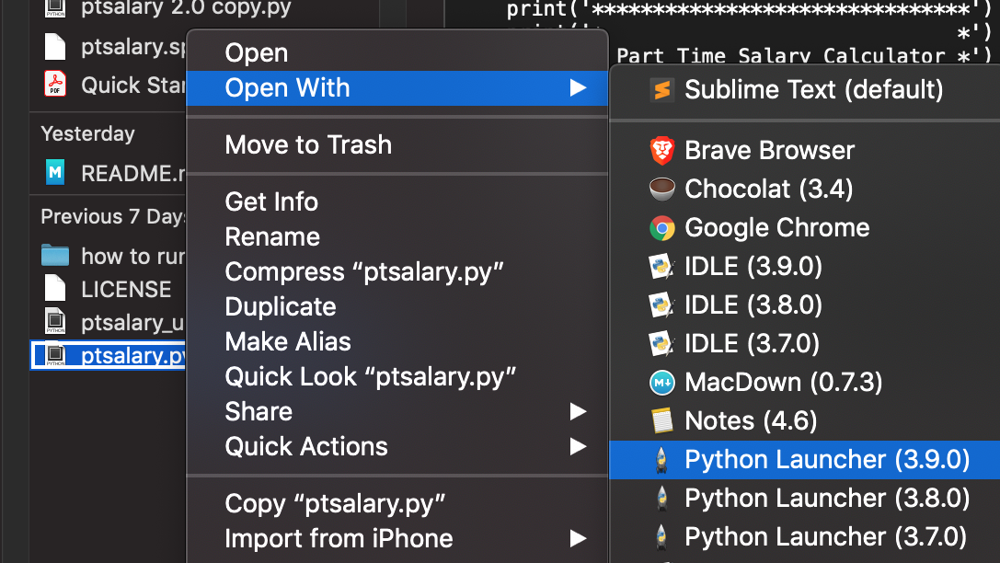
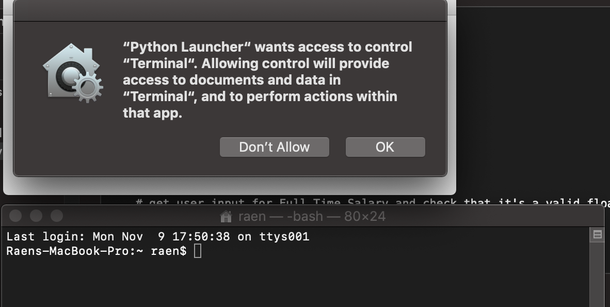

# Part Time Salary Calculator:  Quick Start Guide
This guide will walk you through installing Python and using the ptsalary app.

If you're looking at this and you're in HR but don't have any coding experience you're probably thinking, how do I run this ptsalary.py file? This document will help get you up and running, at least somewhat easily.

## Requirements
 - Python 3.x.x
 - Windows, MacOS, Linux

--

# Install Python. Run the Script.
After you've downloaded the ptsalary.py script you'll need to check whether you have Python installed and if so which version.

To run ptsalary.py you'll need Python 3.x or higher.

## Mac OS X 
If you have a Mac you likely already have an older version of Python installed. However, you'll need to have at least version 3.0 to use Part Time Salary Calculator. 

### Check Current Version of Python
To check your current, default, version of python open up terminal and type:
 
``user$ python --version``

To check which version of python3 is installed type: 

``user$ python3 --version``

As of this writing the current version of python is 3.9.0. 

If you don't have 3.x or higher Part Time Salary Calculator will not run so be sure to update to the latest version.

### Install Python
You can install python from Terminal however you can also go to [python.org](https://www.python.org/downloads/) and download the latest version. When the pkg is done downloading run it and follow the on screen prompts. 

### Run ptsalary.py Using the GUI

Find ptsalary.py, right click it and go to Open With > Python Launcher (3.x.x)

 
 
**If OS X asks for permissions click yes.**

## Windows
Windows does not come with Python already installed so you'll likely need to install Python first. However, if you'd like to make sure it's not already installed you can do so from the command prompt.

Open up a command prompt by pressing the Windows Key ⊞ and type 'command' into the search box.
 
 
Next to the C:\ prompt type:

``C:\Users\yourName> python --version``

### Installation
If python isn't installed or you only have a version prior to 3.x you'll need to download a copy.

[Download python for windows here: ](https://www.python.org/downloads/windows/)https://www.python.org/downloads/windows/

Select the latest version compatible with your version of Windows. Once the installer has finished downloading run it and follow the on screen prompts.

Note that version 3.9.x is not compatible with Windows 7 and earlier versions. 

### Run ptsalary.py Using the GUI 

Once you've installed the latest version of Python you can simply double click the app's icon. 

